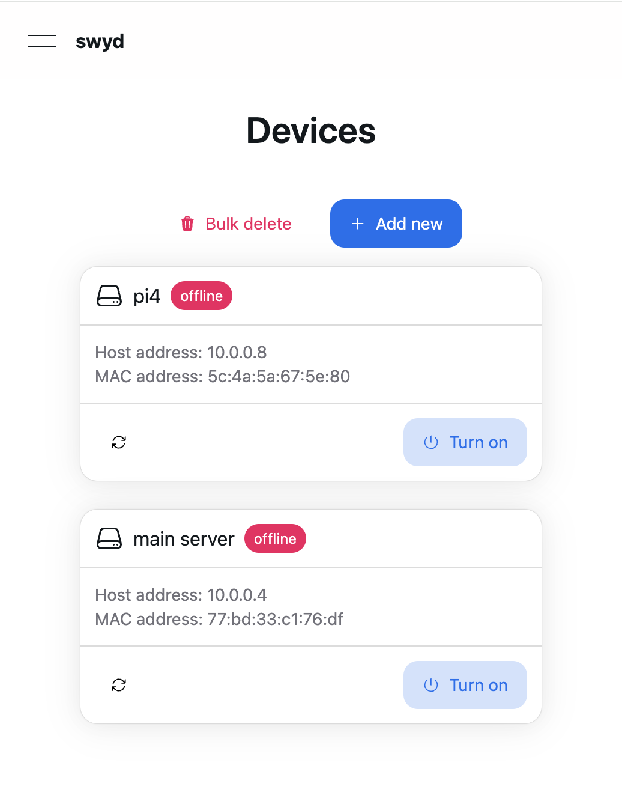
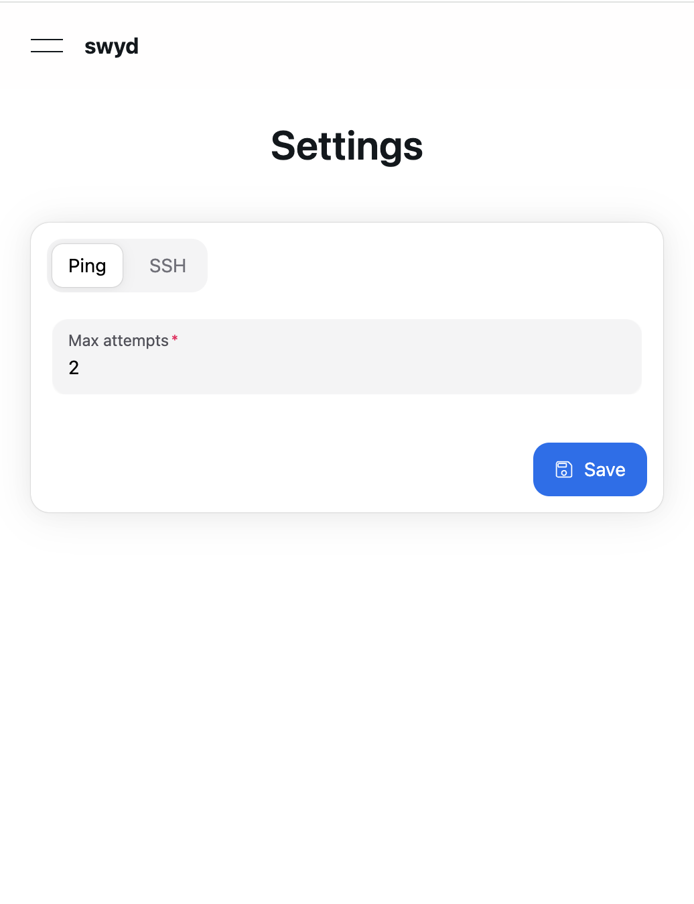
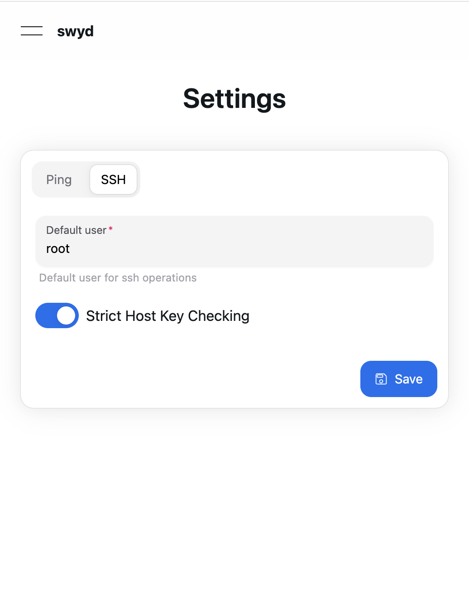
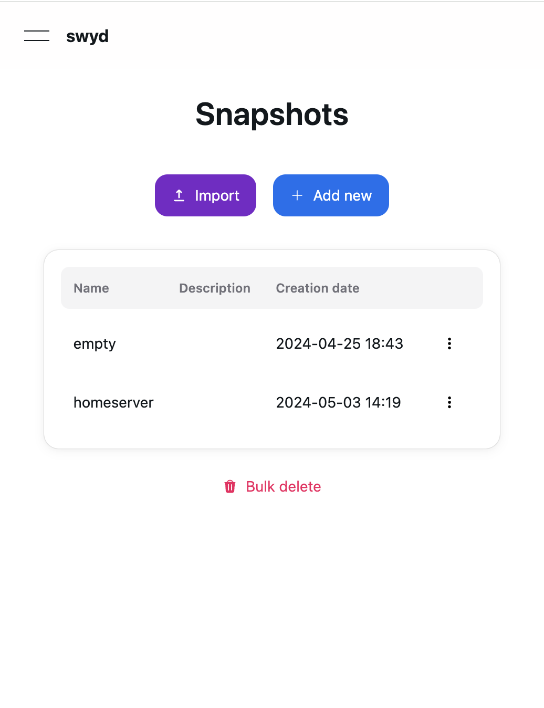
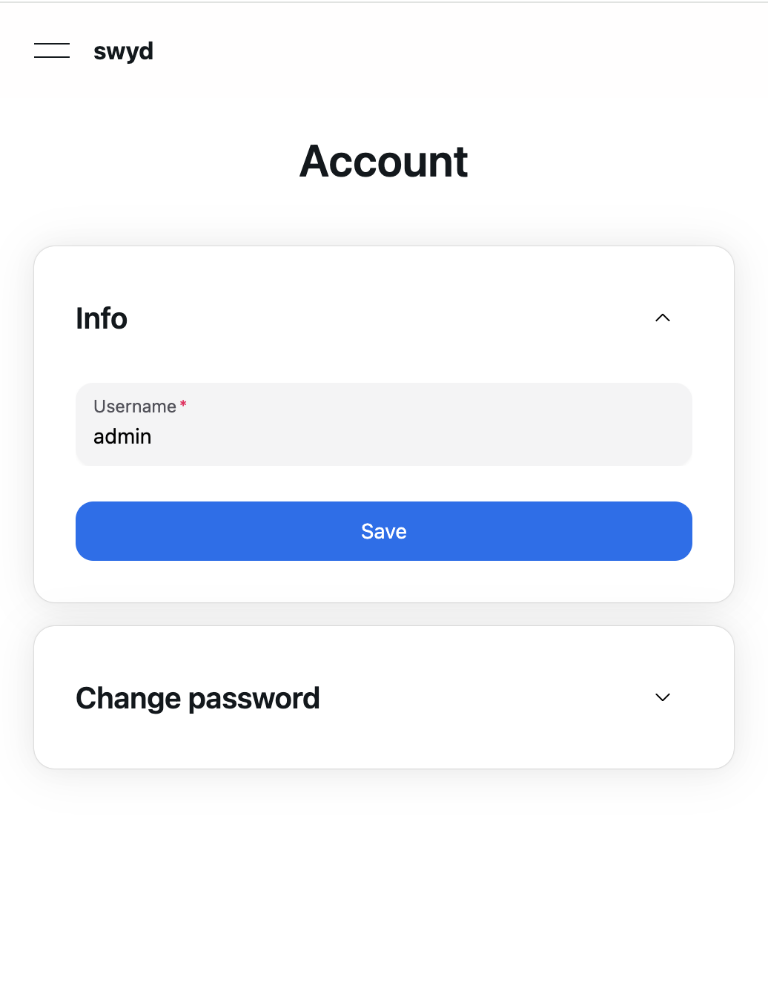
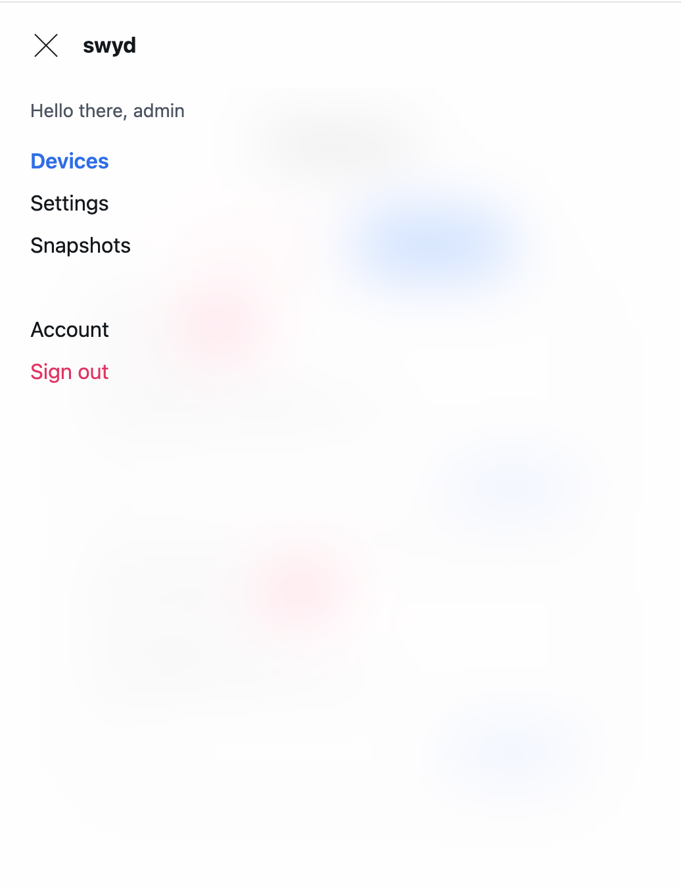

# swyd

Tired of manually booting up and powering off your LAN devices using the terminal? Try **swyd** instead! 

## Key features

- Check whether your devices are currently online and turn them on and off by simply pressing a button
- Create and restore backups (**snapshots**)
- Provides out of the box username/passsword authentication to secure the access
- Fully responsive UI! Turn on your media server using your phone!

## Prerrequisites

**swyd** is just a friendly user interface to operate your devices. 

You will still need to:
- Enable wake-on-lan capabilities in all devices you would like to remotely turn on
- Install the SSH credentials of the server hosting **swyd** in all devices you would like to remotely turn off (`ssh-copy-id`).

## Setup

> **swyd** runs on port `23254`

### Docker

The easiest way to deploy **swyd** is through Docker. Here's a sample `docker-compose.yaml` file:

```yaml
version: '3.8'

services:
  swyd:
    image: ghcr.io/joseantmazonsb/swyd:latest
    container_name: swyd
    restart: unless-stopped
    network_mode: host
    environment:
      - SWYD_ROOT=/etc/swyd # Configuration files
      - SWYD_SNAPSHOTS=/var/swyd/snapshots # Backups
      - SWYD_PRIVATE_KEY=verysecret # Authentication
    volumes:
      # Optional, to persist data if the container is stopped
      - /srv/swyd:/etc/swyd
      - /var/swyd/snapshots:/var/swyd/snapshots
```

## Screenshots






